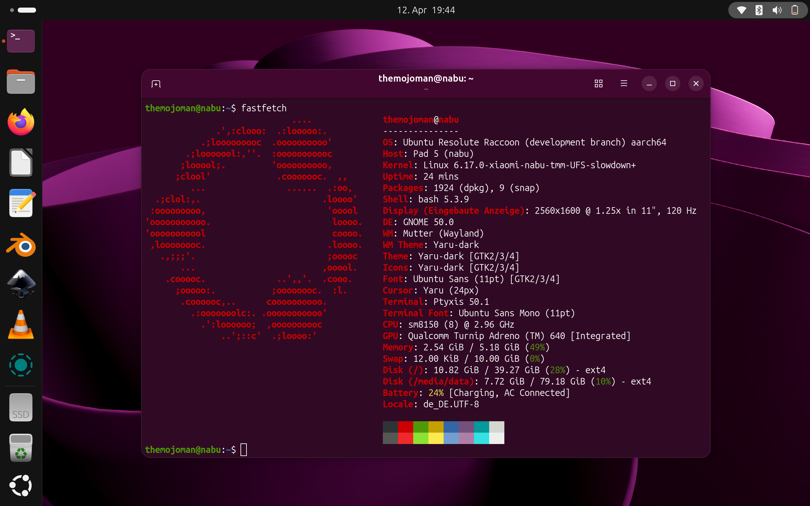

# Ubuntu Linux on Xiaomi Pad 5 (nabu) - Installation Guide

### ⚠️ Disclaimer
*   **Read the instructions once completely before starting the installation process.**
*   This project is not officially endorsed, supported, or affiliated with Ubuntu, Canonical, Xiaomi, or any other hardware or software vendor.
*   I am not responsible for bricked devices, dead SD cards, or data loss.
*   You are choosing to make these modifications at your own risk.
*   **!!!BACKUP ALL YOUR DATA!!!** - Android `userdata` will most likely be lost during this process.

---

## 🛠 Prerequisites

* The boot loader of your tablet must be unlocked!
* Ensure you have downloaded all necessary files to your PC (click on file name in left column):

| File | Description | Author & Link |
| :--- | :--- | :--- |
| [V4-MODDED-TWRP-LINUX.img](https://github.com/TheMojoMan/xiaomi-nabu/releases/download/ubuntu-26.04-v1.0.0/V4-MODDED-TWRP-LINUX.img) | To access the internal disk (+ much more) | [ArKT-7](https://github.com/ArKT-7/twrp_device_xiaomi_nabu/releases/tag/mod_linux) |
| [efi.tar](https://github.com/TheMojoMan/xiaomi-nabu/releases/download/ubuntu-26.04-v1.0.0/efi.tar) | Contains files to boot Linux | [Timofey](https://github.com/timoxa0) & TheMojoMan |
| [setup_ubuntu.sh](https://github.com/TheMojoMan/xiaomi-nabu/releases/download/ubuntu-26.04-v1.0.0/setup_ubuntu.sh) | Partition disk & Copy boot files | TheMojoMan |
| [ubuntu-26.04-xiaomi-nabu.img.xz](https://github.com/TheMojoMan/xiaomi-nabu/releases/download/ubuntu-26.04-v1.0.0/ubuntu-26.04-xiaomi-nabu.img.xz) | Ubuntu root file system (COMPRESSED) | [Canonical](https://cdimage.ubuntu.com/ubuntu-base/releases/26.04/beta/) & TheMojoMan |
| [installer_bootmanager_NOSB.zip](https://github.com/TheMojoMan/xiaomi-nabu/releases/download/ubuntu-26.04-v1.0.0/installer_bootmanager_NOSB.zip) | Patches bootloader to boot LINUX (+ ANDROID + ...) | [rodriguezst](https://github.com/rodriguezst/nabu-dualboot-img) |

### 📦 Important: Unpacking the Image
The Ubuntu image is usually provided as a compressed `.xz` file. You **must** extract it before flashing to get the actual `.img` file.

*   **Windows:** Use the free tool [7-Zip](https://www.7-zip.org/). Right-click the file -> *7-Zip* -> *Extract here*.
*   **macOS:** Use [The Unarchiver](https://theunarchiver.com/) or simply double-click the file in Finder.
*   **Linux (Terminal):**
    ```bash
    xz -d ubuntu-26.04-xiaomi-nabu.img.xz
    ```

---

## 💻 Beginner Guide: Terminal/Shell Basics
If you are not familiar with the command line, follow these steps to get started:

1.  **Open the Terminal:**
    *   **Windows:** Press `Win + R`, type `cmd`, and hit Enter.
    *   **macOS:** Press `Cmd + Space`, type `Terminal`, and hit Enter.
    *   **Linux:** You should know (depends on your used distro).

    **Navigate to your folder:** Type `cd ` (<- space), drag and drop the folder containing your downloads into the terminal, and press Enter.
2.  **ADB/Fastboot:** Ensure you have the [Android Platform Tools](https://developer.android.com/studio/releases/platform-tools) installed.
3.  **History:** Use up/down arrows to scroll through command history. Use Ctrl+R to search in command history. [Mac: Cmd+...]
4.  **Auto-completion:** Type the first two letters of command and then press TAB key. Press TAB twice to get more options.
5.  **Line editing:** Ctrl+A/E: set cursor to beginning/end of line, Ctrl+U/K: delete text to left/right of cursor. [Mac: Cmd+...]
6.  **Copy/Paste:** Select text with mouse than right click and choose copy (Shift+Ctrl+c) or paste (Shift+Ctrl+v). [Mac: Shift+Cmd+...]

---

## 1. Preparation & Partitioning

1.  Put your tablet into **Fastboot Mode**: Shut down tablet, than press and hold down "Volume Down" key while connecting your tablet to a PC/Mac with a USB cable.
    Tablet should power on and show 'Fastboot' after some seconds. Release "Volume Down" key.
2.  Boot the modified TWRP from your PC (repeat if it does not work the first time):
    ```bash
    fastboot boot V4-MODDED-TWRP-LINUX.img
    ```
3.  Once TWRP loads, push the setup files to the tablet, enter the tablet's shell and run the utility:
    ```bash
    adb push setup_ubuntu.sh tmp
    adb push efi.tar tmp
    adb shell "chmod +x tmp/setup_ubuntu.sh && tmp/setup_ubuntu.sh"
    ```
    
    **Inside the script menu:**
    *   **Dry-Run:** Choose "Yes" first to simulate the process safely.
    *   **Partitioning:** 
        *   **Single-Boot:** Choose to **wipe** `userdata` (Option 1). This will remove Android completely!!!
        *   **Dual-Boot:** Choose to **resize** `userdata` (Option 2). This will keep Android (but data will be lost most probably).
    *   **Layout:** Select `esp + linux + data` (Option 2) for the best experience. This allows you e.g. to install a new Linux version without losing all your data.
    *   **Finalizing:** The script will automatically format the ESP and install the bootloader files from `efi.tar`.

---

## 2. Flashing Ubuntu

Once the partitioning is ready and the device is back in **Fastboot Mode**, flash the actual operating system:

```bash
# Flash the UNCOMPRESSED Ubuntu root file system image
fastboot flash linux ubuntu-26.04-xiaomi-nabu.img
```

---

## 3. Patching the Android Bootloader

To be able to boot Linux (and other OS on your disk) we install the boot image patcher by **rodriguezst** via ADB sideload:

1.  On your tablet, go back to the **home screen of TWRP**.
2.  Tap on **Advanced** -> Tap on **ADB Sideload** -> **Swipe the bar** on the screen.
3.  On your PC, run the adb sideload command:
    ```bash
    adb sideload installer_bootmanager_NOSB.zip
    ```
4.  Once finished, you can reboot. Your device will now be able to boot Linux (or you can switch to Android or other installed systems).

---

## 🌐 Alternative: Web-based Tool (Arkt-7)
If you prefer a graphical interface, you can use the Arkt-7 web tool at [arkt-7.github.io/nabu/](https://arkt-7.github.io/nabu/). 
*   It allows you to boot TWRP and flash images via WebUSB.
*   You still need to push `setup_ubuntu.sh` and `efi.tar` to the tmp folder as described above.
*   Run the `setup_ubuntu.sh` script via the TWRP terminal: Tap on **Advanced** -> Tap on **Terminal** -> Type: `chmod +x tmp/setup_ubuntu.sh && tmp/setup_ubuntu.sh`.

---

## ⚠️ Troubleshooting & Known-issues

*   **Kernel Boot Issues:** **Kernel 6.17** does not boot reliably on all devices, particularly those with **Samsung UFS** drives.
	If screen stays black for more than 30 seconds, hold power button until tablet reboots. Try several times. If it consistently fails,
	use **Kernel 6.14.11** which boots on every tablet.
*   **Files app:** long-tap on folder opens context-menue but long-tap on background not -> use mouse for right-click or terminal to create new folders with `mkdir folder_name`.
*   **Suspend:** Screen sometimes does not turn on again after Suspend.
---

## Post-Installation
After booting Ubuntu and doing the initial setup connect to the internet (if you did not do it before).

**Updates & Upgrades:**
*  Open terminal -> click top icon in left bar.
*  Type `cat .bash_aliases`. This shows you a list of shortcuts that I have defined for your (and my) convenience. It will save you a lot of typing in the long run!
   
   [You can add your own shortcuts by editing the file with `micro .bash_aliases`. Do your changes. Save with "Ctrl+s". Quit with "Ctrl+q".]
*  Update the package list: `sudo apt update` (shortcut: `sau`).
*  Upgrade the packages (if there are updates available): `sudo apt upgrade` (shortcut: `saug`).

   Information: The `sudo` command gets you superuser (root) privileges. Only superuser (root) can install new software.

**Change your language settings:**
*  Tap on battery symbol in the top right corner.
*  Tap the settings symbol.
*  Scroll the left column up until you see 'System' at the very bottom. Tap on it.
*  Tap on 'Region & Language' -> 'Manage Installed Languages' -> 'Install/Remove Languages...'.
*  Mark the language(s) to install and tap 'Apply'.
*  Drag your new language up to the top of the list. <- Known-issue: You need to use a mouse for it!
*  Tap 'Apply System-Wide' and 'Close'. Set prefered language and format for 'Your Account'.
*  Log out and log in -> System should use your chosen language now.
 
**Install some common apps:**
*  VLC: `sudo apt install firefox` (shortcut: `sai vlc`).
*  Blender: `sudo apt install blender` (shortcut: `sai blender`).
*  Firefox browser: `sudo snap install firefox` (shortcut: `ssi firefox`).
*  Ubuntu app store: `sudo snap install snap-store` (shortcut: `ssi snap-store`).
*  LocalSend: `sudo snap install localsend` (shortcut: `ssi localsend`).
*  Telegram: `sudo snap install telegram-desktop` (shortcut: `ssi telegram-desktop`).

**Using your 'data' partition:**
*  Type `sudo micro /etc/fstab`. Remove the "#" sign in last line. Save with "Ctrl+s". Quit with "Ctrl+q" and **reboot**.
*  After reboot: Open terminal again and type `sudo chown <your_user_name>:<your_user_name> /media/data`. E.g. `sudo chown tom:tom /media/data` when `tom` is your username.
*  Optional: Please use a search engine or AI assistent to learn how to permanently link your home folders (Download/Pictures etc.) to 'data' partition.

**Using the Xiaomi pen**
*  The pen should work without any further action.
*  [Kernel 6.17 only] To activate charging of pen open terminal and run `sudo modprobe idtp9418`. Tip of pen should point to left.
*  [Kernel 6.17 only] To make activation permanent run `echo idtp9418 | sudo tee /etc/modules-load.d/charge-stylus.conf`.
*  [Kernel 6.17 only] To control charging state open Bluetooth settings, long-press one of the pen buttons until "Xiaomi Smart Pen" appears in Bluetooth settings.
   Connect pen. Now change to 'Energy' setting. Under 'Connected Devices' it should show charging state.
---

## Credits

I would like to thank the following people (more or less in chronological order) for their excellent work in developing the Linux kernel and/or essential tools for the Xiaomi Pad 5.
Without them this would all not be possible:
*   **Alexandru Marc Serdeliuc** <https://github.com/serdeliuk>
*   **map220v** <https://github.com/map220v>
*   **maverickjb** <https://github.com/maverickjb>
*   **Pan Ortiz** <https://gitlab.com/panpanpanpan>
*   **Viola Guerrera** <https://github.com/nik012003>
*   **rodriguezst** <https://github.com/rodriguezst>
*   **Timofey** <https://github.com/timoxa0>
*   **Amrit Ranjan** <https://github.com/arkt-7>
*   **jhuang** <https://github.com/jhuang6451>
*   **gmanka** <https://github.com/gmankab>

---

## Other great Linux distributions for nabu

* [postmarketOS](https://wiki.postmarketos.org/wiki/Xiaomi_Pad_5_%28xiaomi-nabu%29) - pmOS for nabu
* [fedora_nabu](https://github.com/jhuang6451/nabu_fedora) - Fedora for nabu
* [pocketblue](https://github.com/pocketblue/pocketblue) - Fedora Atomic for mobile devices 

---

## Xiaomi Pad 5 on Telegram
<https://t.me/nabulinux> - Special Thanks to Mateus Lima for managing the group!
